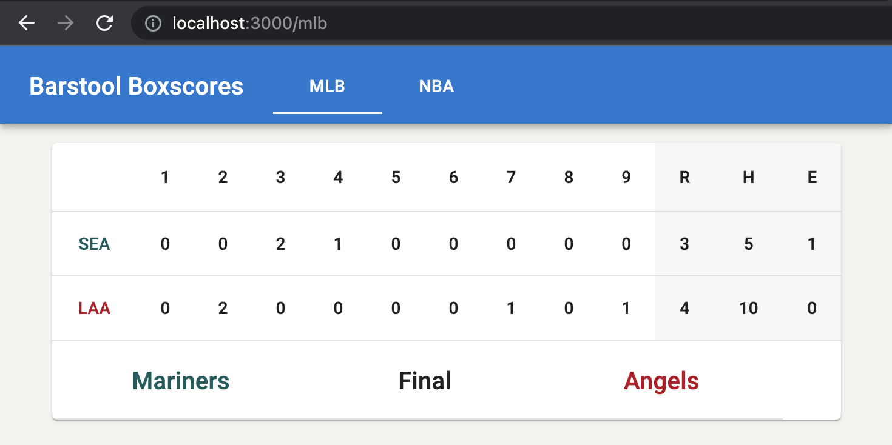
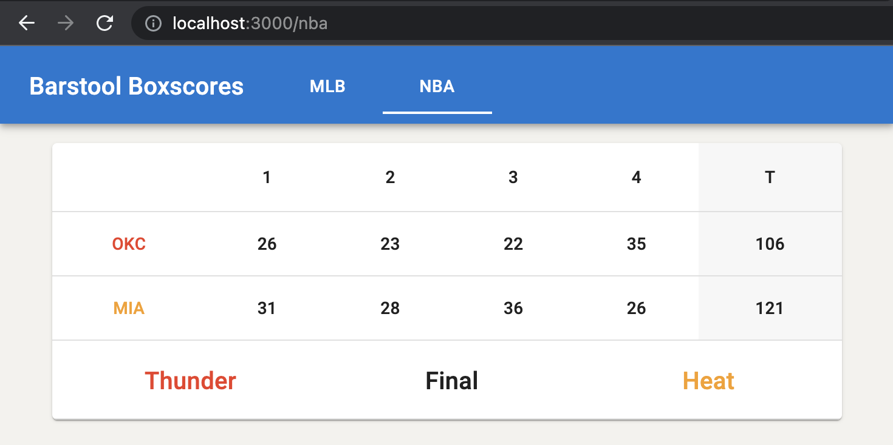

# The Boxscore Challenge

An implementation of [Barstool's Fullstack Challenge](https://github.com/BarstoolSports/fullstack-challenge).

## Run the application

### Prerequisite

A running MongoDB instance and local environment variables referencing the `DB_URI` and the `DB_NS`

### Backend

Run `nodemon server` in the backend directory

### Client

Run `npm start` in the client directory

## Stack & Tools

### Backend

- Node
- Express
- MongoDB

### Client

- React
- React Router DOM
- Material UI

## Functionality

- The client accepts two valid URL paths, `/mlb` and `/nba`, and otherwise displays a `Page not found` page
- When a valid path is accessed, the client makes a GET request to the backend, passing the applicable league as a param, e.g. `league=mlb`
- The backend checks the MongoDB instance for a valid cached copy of the requested league's data (i.e. last updated within 15s)
  - If valid, the cached data is returned to the client
  - If invalid, the backend makes a GET request to the feed API (stubbed JSON), caches the response, then returns that response to the client
- The client handles and displays the data as required for the active league
